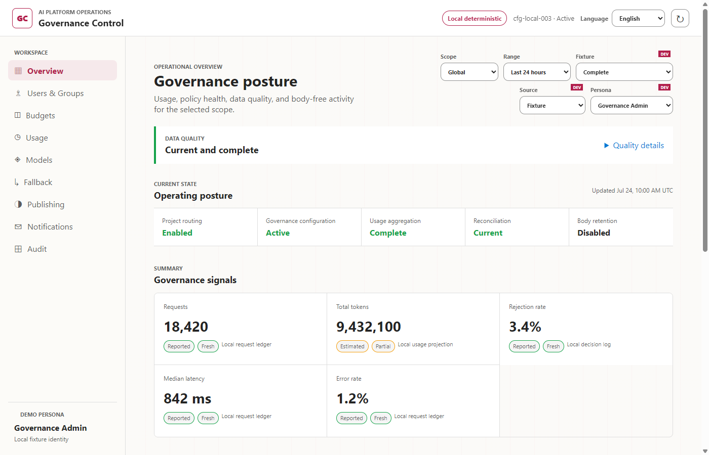
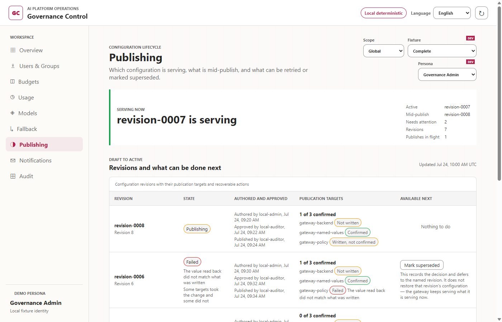
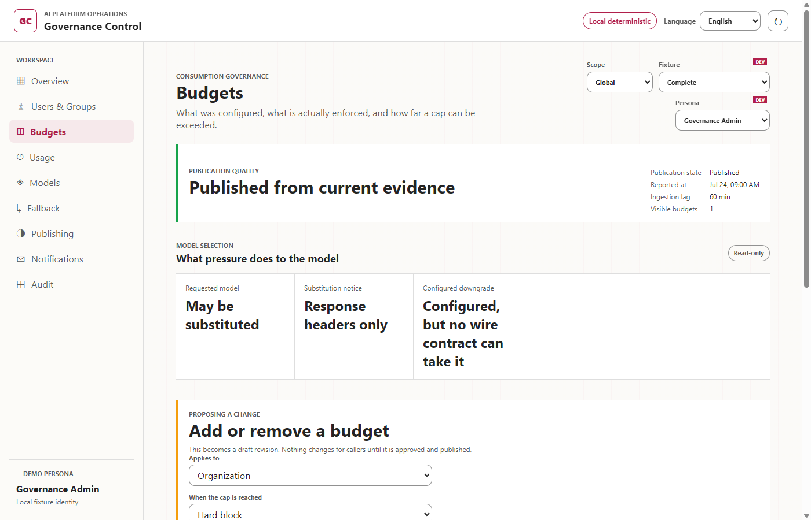
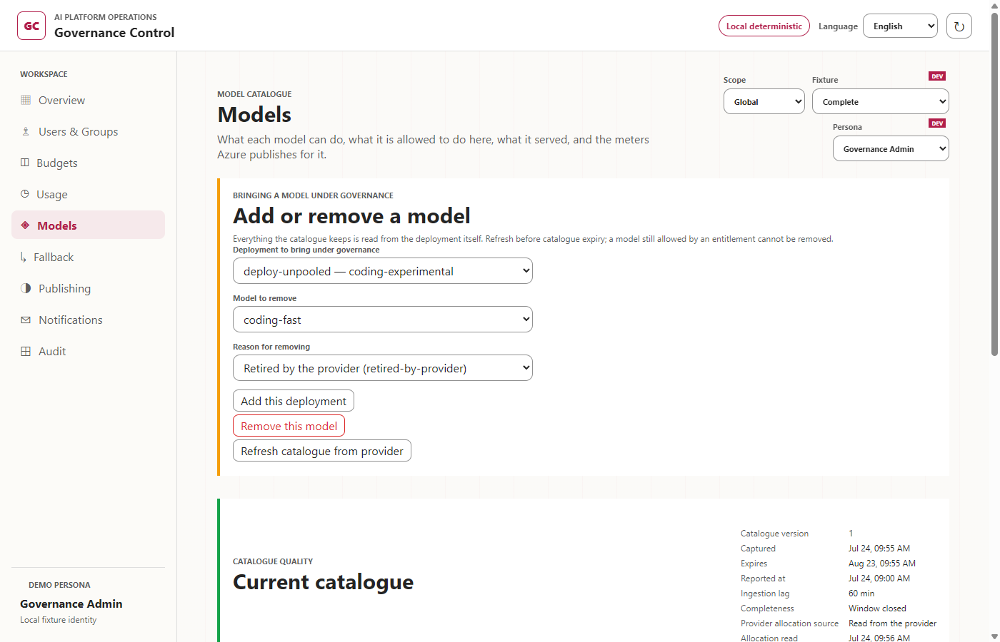
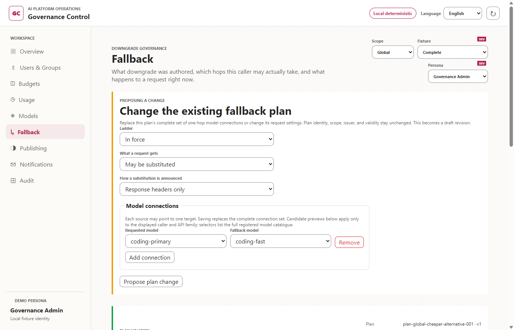
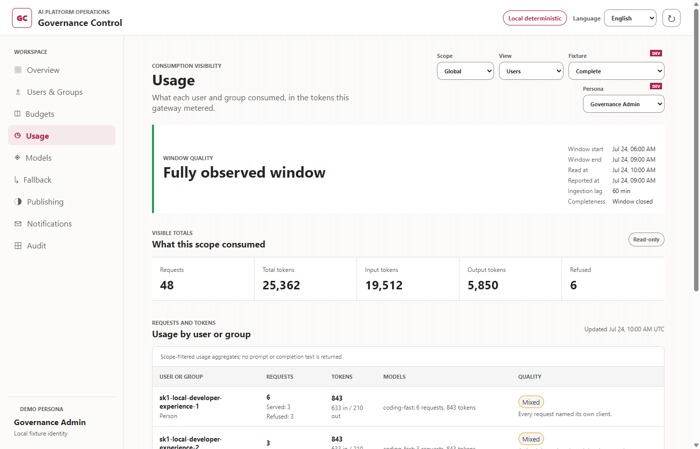
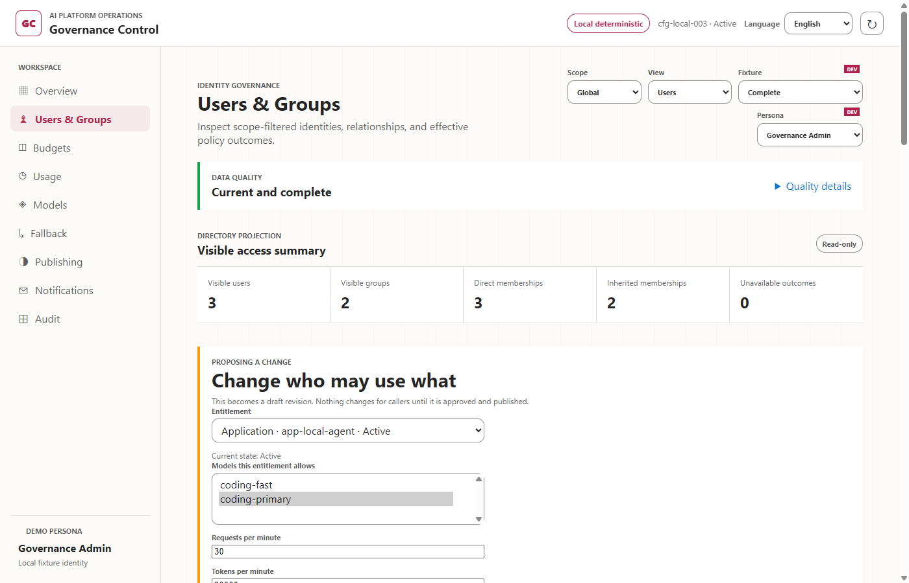
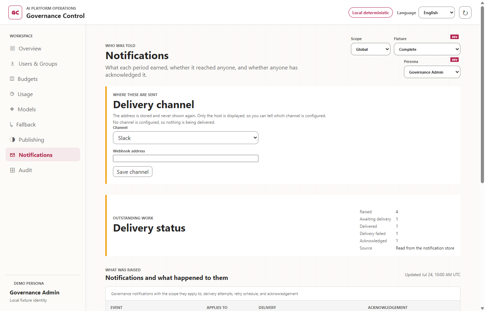
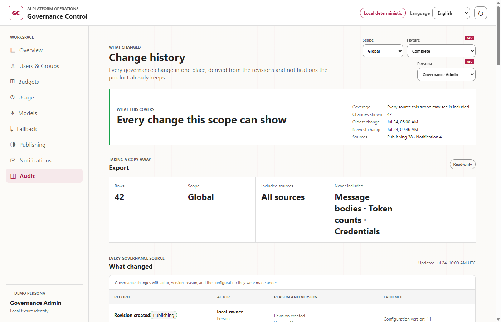

# Using The Administration Console

The console is where an administrator sees what the gateway is doing and changes what it allows. This guide walks through it in the order a first-time administrator needs, and says what each screen is claiming so you can tell a real answer from an absent one.

Two facts apply throughout the console.

**A bootstrap import is approved and published in one step; every subsequent supported change is stored as a draft.** A different write-capable administrator must resume the draft to approve and publish it. An explicitly configured own-approval capability is the only exception, and the lifecycle records that approval as an exception. The new revision governs requests only after every publication target confirms it. If publication stops partway through, callers keep getting the previous active revision.

**A screen that cannot answer refuses instead of showing nothing.** An empty table and a store that has never been written are different facts, and the console does not render them alike. When you see a refusal with a reason code, that is the product declining to present an answer it does not have.

Screenshots on this page show the current local deterministic UI with synthetic fixtures, not an Azure deployment result. Demo personas, DEV selectors, and sample metrics are local-only examples; a deployed console shows the identity you signed in with.

## Getting In

The console URL is the `ADMIN_INTERFACE_ENDPOINT` output of the deployment. Sign in with the Microsoft Entra account that holds the administration role assigned during deployment. See [Deploying The Gateway](01-deployment.md) for how that role is assigned and changed.

What you can do is decided by the role your account holds, not by the screen. A screen you may read but not change shows a **Read-only** marker on each section you cannot act on, rather than offering a control that would be refused after you click it.

## Overview

The posture row is the fastest read of whether the deployment is working: which configuration is serving, whether usage aggregation is complete, whether reconciliation is current, and whether message bodies are being retained. Body retention is `Disabled` by default and should stay that way unless you decided otherwise.

Under it, each figure carries how it was obtained. `Reported` and `Fresh` mean the number came from the gateway's own usage rollup and the window it covers has closed.

**`Unknown` is an answer, not a gap.** Where the deployed usage path does not collect median latency or error rate, those values read `Not collected`. The local fixture values in these screenshots are not Azure measurements. A figure the product cannot measure is labelled rather than filled with a plausible number.

## Publishing

This screen is the one to open when you are not sure whether a change reached callers. The banner names the revision that is serving right now. Below it, every revision shows the lifecycle actor codes recorded for authoring, approval, and publication, plus the publication targets that confirmed. Bootstrap authoring alone uses its bootstrap code; every later deployed administrative write uses a stable, versioned pseudonymous actor code derived with the deployment's key from the authenticated administrator's validated tenant and object identifiers. The code distinguishes administrators while the active key version is retained, but does not store those identifiers, names, emails, claims, or credentials. A write whose administrator identity cannot be established is refused with `caller_not_identifiable` before it is persisted or published.

A revision that shows fewer confirmed targets than it has is mid-publish, and the previous revision is still what callers get.

A later draft cannot be approved by its author. A different write-capable administrator resumes it to record the distinct approval and publish it; an explicitly granted own-approval capability is recorded as such rather than presented as an ordinary review.

To approve or retry, the console sends an approval-only request, `{ "resume": true, "revisionId": "revision-0002" }`. It identifies an already stored proposal and contains no configuration or mutation fields. The service loads and publishes the immutable stored proposal, so a reviewer cannot substitute content and the recorded author remains the author of what is published.

A target failure changes the lifecycle to `failed`; fix its cause and retry the stored proposal, which retries only the unfinished targets. To change a draft, its author must withdraw it and submit a new proposal. A draft author can abandon their own unapproved proposal with `POST /v1/admin/governance/publish` and `{ "command": "withdraw", "revisionId": "revision-0002" }`. This records a terminal withdrawal without publishing content; readers and other administrators cannot withdraw it.

The console exposes `{ "command": "abandon", "revisionId": "revision-0002" }` only when the service permits recovery abandonment: a legacy, bootstrap, or shared-author draft, approval, failed proposal, or publishing proposal has no verified target, and its author cannot be matched to the current administrator. It additionally requires both the publish and elevated own-approval capabilities. Any verified target refuses abandonment with `proposal-abandonment-verified-targets`; a draft or approval carrying any publication activity is also refused. Repair and retry instead. A legacy revision with no stored proposal likewise refuses content replacement: with verified targets it reports `legacy-recovery-required`, and with none it reports `legacy-recovery-abandon-required` until an elevated administrator abandons it and creates a fresh proposal.

## Budgets

A budget is authored here and applies from the moment it is published. The screen separates what was configured from what is enforced, because they are not the same question.

Budgets are best effort. A cap can be passed before enforcement catches up, and the screen reports how far. If you need a hard guarantee that no request exceeds a number, this product does not provide one; see the limitations in [Deploying The Gateway](01-deployment.md#operating-limitations).

Budgets do not merge into a single number, and every applicable counter can stop a request. Publication and enforcement preserve the authored budget identity, version, scope, model, period, action, threshold, and accounting basis. Unsupported or ambiguous combinations are rejected before publication rather than silently sharing a counter. The policy checks in [Operating And Removing An Evaluation Environment](03-operations.md) describe the combination rules.

### Budget actions

Budgets use tokens, not currency. The accounting basis is `apim-estimated-total-tokens`; Azure Billing remains the source for monetary cost. Budget actions and model fallback are separate settings.

| Action | Behavior | Threshold settings |
|---|---|---|
| `HARD_BLOCK` | Blocks when the configured token quota is exhausted. There is no grace allowance. | Optional `warnAtBasisPoints` for an earlier warning, from 1 to 9,999. |
| `SOFT_WARNING` | Warns near the configured limit and blocks at the limit plus the grace allowance. It is not warning-only, unlimited use. | Required `graceBasisPoints`, from 1 to 10,000. |
| `THROTTLE` | Applies a request-rate tier at each configured usage threshold. It does not create a hard token quota of its own; other applicable quotas can still block. Requests above the rate receive `429`. | Increasing `atBasisPoints` thresholds, from 1 to 20,000, each with a supported `tierCode`. |

Thresholds use basis points: 100 means 1%, 500 means 5%, and 10,000 means 100%. For a 1,000,000-token budget, `HARD_BLOCK` caps at 1,000,000 tokens. `SOFT_WARNING` with `graceBasisPoints: 500` warns near 1,000,000 and caps at 1,050,000 tokens. APIM warning thresholds use whole percentages, so the warning point may differ from the authored threshold. Both caps remain best effort.

The current deployment supports `tier-reduced` and `tier-minimal`. Their request rates are configured by the gateway: one half and one tenth of the deployment's `requestsPerMinute`, respectively, rounded down with a minimum of one request per minute. The console selects these tiers and their trigger thresholds; it does not set new tier codes or edit their request rates. For example, a throttle budget can select `tier-reduced` at 8,000 basis points and `tier-minimal` at 9,500. These are illustrative settings, not recommended production defaults.

### Creating and editing a budget

1. A write-capable administrator opens **Budgets** and adds a budget or edits an existing row. Read access alone does not authorize a change.
2. For a new budget, select `organization`, `team`, `subject`, or `application`. An existing budget's scope is not editable; changing it requires a separately reviewed removal and addition.
3. Select `all-models` or `per-model`. A per-model budget requires a logical model key from the published model catalogue and is supported only for organization and team scopes. Subject and application scopes support all-model budgets only.
4. Select `Hourly`, `Daily`, `Weekly`, `Monthly`, or `Yearly`, then enter a positive whole-number token limit.
5. Select the action and its threshold settings. An edit can change the amount, period, model coverage, action, and thresholds. Switching to all models removes the individual model key. Unsupported combinations and overlapping budget coverage are refused. The same scope and model coverage can have one quota budget (`HARD_BLOCK` or `SOFT_WARNING`) and one `THROTTLE` budget. Choosing another period does not permit a second budget of the same kind.
6. Submit the proposal, then follow the approval and publication flow in [Publishing](#publishing). Saving a draft does not change the active budget. Another write-capable administrator approves it unless explicitly granted self-approval applies; the change takes effect only after the publication targets are verified.

Changing a budget's settings creates a new version; an unchanged submission is refused. APIM counter keys include the budget ID and version, so the new version does not inherit the previous version's consumption counter. Editing a budget is not a way to preserve a continuous billing-period total; the usage history remains a separate record.

### Blocking a model without fallback

To cap one model without switching to another, use an organization- or team-scoped `per-model` budget, select the target model, set the period and token limit, and choose `HARD_BLOCK`. Leave the applicable fallback plan disabled or unconfigured. An earlier warning threshold is optional and does not enable fallback by itself.

When that model's quota is exhausted, APIM refuses the request before forwarding it to Foundry with `403 token_quota_exceeded` and a `Retry-After` header. It does not select an alternative model. Requests remain blocked until the period resets or an administrator changes the applicable limit. This budget alone does not block other models; their own and any shared limits still apply. In-flight requests can still complete, so this is not an exact monetary spending ceiling.

## Models

The catalogue shows what each model can do, what this deployment allows it to do, what it served, and the meters Azure publishes for it.

You bring a model under governance by selecting one of the deployment's own model deployments; the console reads the choices from the deployment rather than asking you to type a name. Removing a model asks for a reason, and a model still allowed by an entitlement cannot be removed, so the catalogue cannot quietly stop covering something a caller is still entitled to.

Retiring an entitlement does not delete its model references. Removing a model still referenced by a revoked binding requires an approved whole-set replacement that removes the references consistently. The targeted console editor does not delete bindings. Provider capture and price controls appear only when the generated deployment configuration declares those routes available; supported deployment modes supply that configuration.

The catalogue is a captured reading with a version and an expiry. Refresh it from the provider before it expires, or the screen will tell you it is reporting a stale one.

## Fallback

A downgrade plan decides what happens when a caller cannot have the model it asked for. Exactly one plan governs a given caller.

The screen answers three separate questions: what was authored, which hops this caller may take and which rule permitted or refused each one, and what would happen to a request right now. A scope with no plan says so, and the request panel says no decision can be shown rather than implying that nothing would happen.

When a plan sends a request to another model, the response is not rewritten to hide that. A caller can therefore receive a model it did not name, and both this screen and the usage records say which one served.

### Editing an existing fallback plan

The editor preserves the existing plan's enabled state, selection intent, and substitution notice. It can replace that plan's model connections without changing its identity, target, issuer, or validity window. Creating a plan for a new scope still requires an approved whole-set publication.

1. Select the scope whose existing plan you intend to change. Enable fallback and choose `preferred` intent if requests may use a substitute; `pinned` intent keeps the requested model.
2. Add, remove, or change source-to-target model connections using registered aliases. A plan can contain at most 32 connections; self-loops, cycles, and multiple outgoing connections from one source are refused.
3. Each request can use only one connection (`maxDepth: 1`), not traverse a multi-hop chain. Several connections map different requested models.
4. Treat the displayed caller/API-family compilation results as a preview, not a guarantee for all callers. Registration, entitlement, and API-family compatibility are checked for the actual caller. The preview does not prove a lower price, equivalent capabilities, or residency.
5. Submit a changed proposal and complete [Publishing](#publishing). Reordering unchanged connections is not a policy change. Saving a draft does not activate its new connections.

APIM uses a permitted connection when the plan is enabled, intent is `preferred`, and the configured pressure threshold is reached. If no permitted connection exists, the requested model remains subject to all its existing quotas and budgets; fallback does not bypass a block. The reference-only `onExhausted: deny` option is not implemented in the deployed effective-policy/APIM path and is not offered in the console.

## Usage

Usage is reported in the tokens this gateway metered. It counts what passed through the gateway; requests that reached a model by another route are not here, and no screen in this console claims otherwise.

The banner describes the window rather than just dating it: when the window started and ended, when it was read, the ingestion lag, and whether it has closed. A window that has not closed, or that was read inside the lag, is labelled instead of being presented as a final number.

**People appear as pseudonymous keys, not names.** The rows are aggregates, and no prompt or completion text is returned to this screen. If you need to know which person a key belongs to, that mapping is not something the console will show you.

Pseudonymous does not mean anonymous. A subject or application key combined with model, token, policy outcome, and timing data can still be personal data when your organization can link it to a person.

Before onboarding developers, document and approve the monitoring purpose, data categories, recipients, access rules, retention and deletion periods, escalation or rights path, and key-custody and re-identification rules. Review provider and platform diagnostics separately because they may retain message bodies even when this console does not. This PoC does not provide organizational approval or a monitoring notice for you.

## Users And Groups

This screen answers who belongs to each governed team and what policy they end up with, and it is where you change who may use what.

The directory projection at the top is a reading, and it is read-only: it asks only about the groups the published governance set names as teams, so it is not a directory browser and you cannot pick an arbitrary person or group from it. Below it, the entitlement form saves one change as a draft and returns its revision. Saving does not change active access. Follow the approval and publication steps in [Publishing](#publishing); the revision governs new requests only after every target confirms it.

The directory reading needs a Microsoft Graph permission that a deployment does not grant itself. Until an administrator grants it, the reading refuses with `reading_unavailable / directory-snapshot-absent`. Authorized entitlement and assignment authoring remains available independently, using entered keys and published team mappings rather than a directory picker. See [Entra: Directory Reading For Users And Groups](01-deployment.md#entra-directory-reading-for-users-and-groups) for who can grant it and how.

### Editing model access and token limits

The entitlement editor shows the selected binding's allowed models, requests per minute, tokens per minute, token quota, and quota period. Selecting another binding reloads its own values. Limits are independent of budgets: a request must satisfy every applicable control, not just the value edited on this screen.

1. Select an existing entitlement to edit its allowed models and limits, or use **Add an entitlement** for a person, application, or existing governed team.
2. For a person or application, enter the subject or application key used by the gateway, not a display name or email address. For a team, choose its published team mapping. The organization-wide ceiling is edited through its existing binding, not added as a second entitlement.
3. Set the rate limits and, when needed, a token quota together with its period: `Hourly`, `Daily`, `Weekly`, `Monthly`, or `Yearly`. These are token limits, not currency amounts.
4. A blank field on a new entitlement adds no limit. Editing an existing limit requires an explicit replacement value; clearing its field does not remove the persisted limit. A quota and its period must be supplied together. An unchanged submission is refused.
5. Submit the proposal and complete [Publishing](#publishing). Refreshing before publication still shows the active binding, not the draft's proposed values.

Active non-global entitlements can be retired (`state: revoked`), and revoked, unexpired entitlements can be restored (`state: active`). The organization ceiling cannot be retired. Inactive bindings retain their models and limits, which are read-only until restored. State changes preserve the original grant reason; revision history records the actor and change. Retirement is not deletion: removing a referenced team or model requires a consistent whole-set replacement, because removal validation also checks revoked bindings.

### Governance policy assignments

**Grant a governance-policy role** edits the versioned governance assignment snapshot. Select the role, assignee kind and key, and scope from the supported combinations; enter an assignment identifier and a bounded reason code. A team-scoped assignment also names a published team. Granting or revoking an assignment creates a draft and follows the same approval and publication process.

In a deployed environment, this does **not** create Microsoft Entra app-role assignments or grant access to the administration console or API. Deployed administrative permissions come from app roles in the caller's validated access token; manage those roles in Microsoft Entra. Snapshot assignments contribute governance-policy role and scope evidence, and do not grant model access without an entitlement. Local demo personas use snapshot assignments for their demonstration authorization and are not proof of deployed Entra access.

### Bringing a directory group under governance

Because this screen does not browse the directory, you name the group yourself. The team form takes a team name and the group's **object ID**. Submitting it saves the new team mapping as a draft, not an active mapping. Follow the approval and publication steps in [Publishing](#publishing) before expecting it in the directory projection or caller policy.

To find the object ID, open the [Microsoft Entra admin center](https://entra.microsoft.com), go to **Entra ID** > **Groups** > **All groups**, select the group, and copy **Object ID** from its overview. It is a GUID.

Membership itself stays in the directory. Adding a team decides which group this product governs; who is in that group is changed in Entra, and the console never writes to it.

## Notifications

Notifications record what each period earned, whether it reached anyone, and whether anyone acknowledged it. The counters separate raised, awaiting delivery, delivered, failed, and acknowledged, so a finding that was raised but never delivered is visible as undelivered rather than quietly dropped.

The delivery channel is configured on this screen. **The address is stored and never shown again.** Only its host is displayed afterwards, which is enough to tell which channel is configured and not enough to recover the webhook. Keep your own copy of the address; if you lose it, you set a new one rather than reading the old one back.

Reading notifications does not grant authority to acknowledge them or change their channel. Those mutations require the notification write capability and are refused before request content is read or an actor is recorded.

The console is enough if someone is looking at it. For what the two supported channels expect and how delivery behaves, see [Sending Governance Notifications to a Chat Channel](05-notifications.md).

## Change History

Every governance change appears here with its recorded actor code, version, reason, and the configuration it was made under. The coverage line states what the trail includes for the scope you are viewing, so a short list is distinguishable from a filtered one. Deployed administrative actor codes are stable pseudonyms for the active key version, so this view can distinguish administrative actions without exposing a person's direct identifier.

**This is a record of what changed, not a tamper-evident ledger.** It makes no claim to detect alteration of its own contents. If you need that property, it has to come from somewhere else.

Export is available to roles permitted to take a copy away. A role that may read the trail but not export it is told so in place of the control.

## Where To Go Next

- [Deploying The Gateway](01-deployment.md) covers deployment, Entra one-time actions, bootstrap, removal, and troubleshooting, and lists what this product does not guarantee.
- [Operating And Removing An Evaluation Environment](03-operations.md) explains safe operation and cleanup, including what a caller gets when organization, team, subject, and application policy all apply.
- [Connecting A Coding Agent](04-connection.md) is what to hand to someone who has to point a tool at the gateway.
- [Sending Governance Notifications to a Chat Channel](05-notifications.md) covers Slack and Microsoft Teams delivery.
